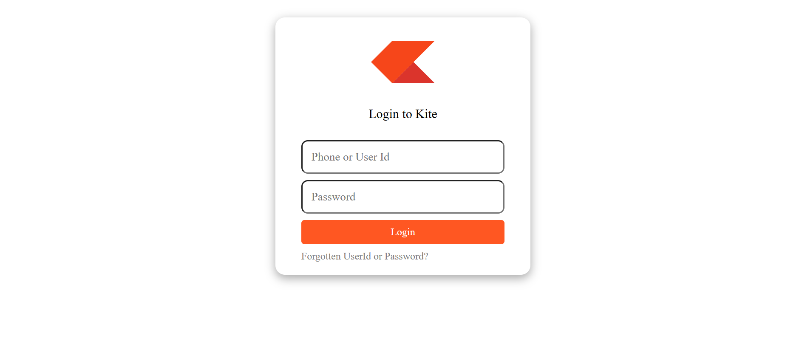

# 🧿 Zerodha Kite Login Page Clone

A responsive and modern login page inspired by Zerodha’s [Kite platform](https://kite.zerodha.com/), built using HTML and CSS.
screenshot
---

## 🚀 Live Demo

🔗 [Click to View](https://Manohar0610.github.io/kite-login)

---

## 📸 Preview

---

## 🛠️ Technologies Used

- HTML5
- CSS3 (Flexbox)

---

## 📁 Folder Structure

## 💡 Features

- Responsive and clean UI
- Hover effects on inputs and buttons
- Mobile-friendly design
- Deployed via GitHub Pages

## 🧑‍💻 Author

**Manohar Reddy Koteru**  
🔗 [GitHub](https://github.com/Manohar0610) | [LinkedIn](https://linkedin.com/in/manoharreddykoteru)

---

Feel free to fork this repo and contribute!

